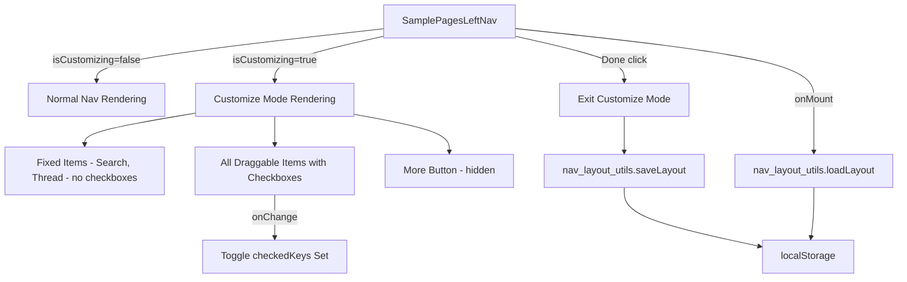
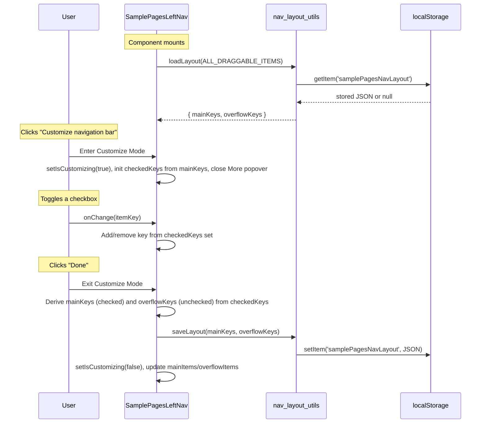

# Design Document: Checkbox Nav Customization

## Overview

This feature replaces the drag-and-drop navigation customization with a simpler checkbox-based approach. When the user clicks "Customize navigation bar" in the More popover, the `SamplePagesLeftNav` enters a Customize Mode where:

1. The sidebar widens by 24px (72px → 96px) to accommodate checkboxes
2. All nav items (main + overflow) are displayed in a single inline list
3. Each customizable item has a checkbox: checked = main nav, unchecked = More popover
4. Search and Thread are fixed (no checkboxes, always at top)
5. The More button is hidden during customize mode
6. A "Done" button at the bottom of the middle area saves and exits

### Key Design Decisions

1. **Reuse `nav_layout_utils.js` from the draggable spec**: The existing utility module already handles `saveLayout`, `loadLayout`, `validateLayout`, and the `ALL_DRAGGABLE_ITEMS` registry. The checkbox feature needs the same persistence layer. We add one new function (`toggleItemZone`) and remove the drag-specific functions (`reorderItems`, `moveItemBetweenZones`) from the checkbox feature's concern — they remain in the module for backward compatibility but are not used by this feature.

2. **No reordering — only toggling**: Unlike the drag-and-drop approach, items cannot be reordered. Checking/unchecking only moves items between the main nav and overflow. The order within each zone is determined by the canonical order in `ALL_DRAGGABLE_ITEMS`.

3. **OuiCheckbox for toggle controls**: The OUI library provides `OuiCheckbox` which handles labeling, keyboard interaction (Tab, Space, Enter), and theme compatibility out of the box. No custom checkbox implementation needed.

4. **Width transition via CSS**: The 72px → 96px width change uses a CSS transition on the `.samplePagesLeftNav` element when the `--customizing` modifier class is applied. This keeps the animation smooth and declarative.

5. **State lifted into SamplePagesLeftNav**: All customize-mode state (`isCustomizing`, `checkedKeys`) lives in the existing component. The `checkedKeys` set tracks which items are checked (main nav). On "Done", this set is converted to `mainKeys`/`overflowKeys` and persisted.

## Architecture



### Data Flow



## Components and Interfaces

### Modified Files

| File | Change |
|------|--------|
| `src-docs/src/views/sample_pages/sample_pages_left_nav.js` | Add customize mode state, checkbox rendering, enter/exit logic, width toggle |
| `src-docs/src/views/sample_pages/_sample_pages_left_nav.scss` | Add styles for `--customizing` width transition, checkbox item layout, Done button |

### New or Modified Utility Functions

The existing `nav_layout_utils.js` (if already created by the draggable spec) is reused. If it doesn't exist yet, it is created with the following interface:

```js
const STORAGE_KEY = 'samplePagesNavLayout';
const FIXED_KEYS = ['search', 'thread'];

const ALL_DRAGGABLE_ITEMS = [
  { key: 'discover', label: 'Discover', icon: 'navDiscover' },
  { key: 'service', label: 'APM', icon: 'navAnomalyDetection' },
  { key: 'alerts', label: 'Alerts', icon: 'navAlerting' },
  { key: 'dashboards', label: 'Dashboards', icon: 'navDashboards' },
  { key: 'skills', label: 'Skills', icon: 'navReports' },
  { key: 'manage-workspace', label: 'Manage workspace', icon: 'wsSelector' },
];

const DEFAULT_MAIN_KEYS = ['discover', 'service'];
const DEFAULT_OVERFLOW_KEYS = ['alerts', 'dashboards', 'skills', 'manage-workspace'];

/**
 * Load layout from localStorage. Returns { mainKeys, overflowKeys }.
 * Falls back to default if missing/corrupted/stale.
 */
export function loadLayout(allItems) { ... }

/**
 * Save layout to localStorage.
 */
export function saveLayout(mainKeys, overflowKeys) { ... }

/**
 * Validate a persisted layout against current items.
 * Discards unknown keys, appends new keys to overflow.
 */
export function validateLayout(stored, allItems) { ... }

/**
 * Toggle an item between main and overflow.
 * If key is in mainKeys, move it to overflowKeys (preserving canonical order).
 * If key is in overflowKeys, move it to mainKeys (preserving canonical order).
 * Returns { mainKeys, overflowKeys }.
 */
export function toggleItemZone(key, mainKeys, overflowKeys, allDraggableItems) { ... }
```

### SamplePagesLeftNav State Additions

```js
const [isCustomizing, setIsCustomizing] = useState(false);
const [mainItems, setMainItems] = useState([]);       // items in main nav zone
const [overflowItems, setOverflowItems] = useState([]); // items in More popover
const [checkedKeys, setCheckedKeys] = useState(new Set()); // keys checked during customize mode
```

### Customize Mode UI Changes

When `isCustomizing === true`:
- The nav gets `samplePagesLeftNav--customizing` class → width transitions to 96px
- Fixed items (Search, Thread) render without checkboxes, with a `--fixed` modifier
- All items from `ALL_DRAGGABLE_ITEMS` render in canonical order with `OuiCheckbox` to the right
- Checked = item will be in main nav; unchecked = item will be in More popover
- The More nav item is hidden from the list
- A "Done" button (`OuiButtonEmpty`) renders at the bottom of the middle area
- On "Done": derive `mainKeys` from `checkedKeys`, derive `overflowKeys` as the complement, call `saveLayout`, exit customize mode

## Data Models

### Nav_Layout (localStorage)

```json
{
  "mainKeys": ["discover", "service"],
  "overflowKeys": ["alerts", "dashboards", "skills", "manage-workspace"]
}
```

| Field | Type | Description |
|-------|------|-------------|
| `mainKeys` | `string[]` | Keys of items visible in the main nav (excludes fixed items and "more") |
| `overflowKeys` | `string[]` | Keys of items in the More popover |

Storage key: `samplePagesNavLayout`

### Default Layout

- **mainKeys**: `['discover', 'service']`
- **overflowKeys**: `['alerts', 'dashboards', 'skills', 'manage-workspace']`

### ALL_DRAGGABLE_ITEMS Registry

```js
const ALL_DRAGGABLE_ITEMS = [
  { key: 'discover', label: 'Discover', icon: 'navDiscover' },
  { key: 'service', label: 'APM', icon: 'navAnomalyDetection' },
  { key: 'alerts', label: 'Alerts', icon: 'navAlerting' },
  { key: 'dashboards', label: 'Dashboards', icon: 'navDashboards' },
  { key: 'skills', label: 'Skills', icon: 'navReports' },
  { key: 'manage-workspace', label: 'Manage workspace', icon: 'wsSelector' },
];
```

### Checked Keys State

During customize mode, `checkedKeys` is a `Set<string>` initialized from the current `mainKeys`. When the user toggles a checkbox:
- Check → add key to set
- Uncheck → remove key from set

On "Done", the set is converted:
- `mainKeys` = items from `ALL_DRAGGABLE_ITEMS` whose key is in `checkedKeys` (preserving canonical order)
- `overflowKeys` = items from `ALL_DRAGGABLE_ITEMS` whose key is NOT in `checkedKeys` (preserving canonical order)


## Correctness Properties

*A property is a characteristic or behavior that should hold true across all valid executions of a system — essentially, a formal statement about what the system should do. Properties serve as the bridge between human-readable specifications and machine-verifiable correctness guarantees.*

### Property 1: Toggle moves item between zones

*For any* valid layout (mainKeys, overflowKeys) and any draggable item key, calling `toggleItemZone` shall move the item from its current zone to the other zone. If the key was in mainKeys, it shall now be in overflowKeys and vice versa. The combined set of keys across both zones shall remain unchanged, and the order within each zone shall follow the canonical order of `ALL_DRAGGABLE_ITEMS`.

**Validates: Requirements 2.1, 2.2**

### Property 2: Fixed items invariant

*For any* sequence of toggle operations applied to a layout, the fixed items (Search and Thread) shall never appear in overflowKeys, and when rendering the full item list, Search and Thread shall always be at positions 0 and 1 in their original order.

**Validates: Requirements 3.2, 3.3**

### Property 3: Checkbox-layout round-trip

*For any* valid layout (mainKeys, overflowKeys), entering customize mode (initializing checkedKeys from mainKeys) and then exiting (deriving mainKeys from checkedKeys and overflowKeys as the complement) without any toggles shall produce a layout equivalent to the original.

**Validates: Requirements 1.5, 5.4**

### Property 4: Persistence round-trip

*For any* valid partition of `ALL_DRAGGABLE_ITEMS` keys into mainKeys and overflowKeys, calling `saveLayout(mainKeys, overflowKeys)` followed by `loadLayout(ALL_DRAGGABLE_ITEMS)` shall return an equivalent layout.

**Validates: Requirements 6.1, 6.2**

### Property 5: Layout validation handles stale data

*For any* persisted layout containing unknown keys (not in current `ALL_DRAGGABLE_ITEMS`) and missing new keys (in `ALL_DRAGGABLE_ITEMS` but not in persisted layout), `validateLayout` shall discard all unknown keys and append all new keys to overflowKeys, producing a layout that contains exactly the current set of draggable item keys.

**Validates: Requirements 6.4**

### Property 6: More button visibility matches overflow state

*For any* layout after exiting customize mode, the More nav item shall be visible if and only if overflowKeys is non-empty.

**Validates: Requirements 4.2, 4.3**

## Error Handling

| Scenario | Handling |
|----------|----------|
| localStorage unavailable (private browsing, quota exceeded) | `saveLayout` wraps `setItem` in try/catch and silently fails. `loadLayout` returns default layout. |
| Persisted JSON is malformed | `loadLayout` catches JSON.parse errors and returns default layout. (Req 6.3) |
| Persisted layout references removed nav items | `validateLayout` filters out unknown keys. (Req 6.4) |
| New nav items added to code but not in persisted layout | `validateLayout` appends new keys to overflowKeys. (Req 6.4) |
| User toggles all items unchecked | Allowed — all customizable items go to overflow, More button appears. Main nav shows only fixed items. |
| User toggles all items checked | Allowed — all customizable items in main nav, More button hidden since overflow is empty. (Req 4.3) |

## Testing Strategy

### Unit Tests

1. **Enter customize mode**: Click "Customize navigation bar" → verify `isCustomizing` becomes true, More popover closes, all items visible with checkboxes.
2. **Exit customize mode**: Click "Done" → verify `isCustomizing` becomes false, width restored, customize UI removed.
3. **Fixed items have no checkboxes**: In customize mode, verify Search and Thread do not render checkboxes.
4. **More button hidden in customize mode**: Verify the More nav item is not in the customize list.
5. **Checkbox initial state**: Enter customize mode with known layout → verify checked/unchecked states match mainKeys/overflowKeys.
6. **Default layout on first load**: With empty localStorage, verify items render in default order.
7. **Corrupted localStorage fallback**: Set malformed JSON in localStorage, mount component, verify default layout renders.
8. **Keyboard accessibility**: Verify checkboxes are focusable via Tab and toggleable via Space/Enter.
9. **Labels associated with checkboxes**: Verify each checkbox has a label matching the nav item name.
10. **Done button keyboard reachable**: Verify Done button is reachable via Tab.
11. **More button visibility**: After exiting with all items checked, verify More button is hidden. After exiting with some unchecked, verify More button is visible.

### Property-Based Tests

Property-based tests use `fast-check` with a minimum of 100 iterations per property.

**Test 1: Toggle moves item between zones**
- Generator: random valid partition of `ALL_DRAGGABLE_ITEMS` keys into mainKeys/overflowKeys, random key from the combined set
- Assert: toggled key moves to the other zone, combined set unchanged, canonical order preserved
- Tag: `Feature: checkbox-nav-customization, Property 1: Toggle moves item between zones`
- **Validates: Requirements 2.1, 2.2**

**Test 2: Fixed items invariant**
- Generator: random sequence of toggle operations (random keys, 1–20 operations) applied to a random starting layout
- Assert: after all operations, fixed keys never appear in overflowKeys
- Tag: `Feature: checkbox-nav-customization, Property 2: Fixed items invariant`
- **Validates: Requirements 3.2, 3.3**

**Test 3: Checkbox-layout round-trip**
- Generator: random valid partition of `ALL_DRAGGABLE_ITEMS` keys into mainKeys/overflowKeys
- Assert: initializing checkedKeys from mainKeys, then deriving mainKeys/overflowKeys from checkedKeys produces the original layout
- Tag: `Feature: checkbox-nav-customization, Property 3: Checkbox-layout round-trip`
- **Validates: Requirements 1.5, 5.4**

**Test 4: Persistence round-trip**
- Generator: random valid partition of `ALL_DRAGGABLE_ITEMS` keys into mainKeys/overflowKeys
- Assert: `loadLayout` after `saveLayout` returns equivalent layout
- Tag: `Feature: checkbox-nav-customization, Property 4: Persistence round-trip`
- **Validates: Requirements 6.1, 6.2**

**Test 5: Layout validation handles stale data**
- Generator: random stored layout with some unknown keys added and some current keys removed
- Assert: `validateLayout` output contains exactly the current draggable keys, unknown keys discarded, new keys in overflow
- Tag: `Feature: checkbox-nav-customization, Property 5: Layout validation handles stale data`
- **Validates: Requirements 6.4**

**Test 6: More button visibility matches overflow state**
- Generator: random valid partition of `ALL_DRAGGABLE_ITEMS` keys into mainKeys/overflowKeys
- Assert: More button visible iff overflowKeys.length > 0
- Tag: `Feature: checkbox-nav-customization, Property 6: More button visibility matches overflow state`
- **Validates: Requirements 4.2, 4.3**

Each correctness property is implemented by a single property-based test. Each test must reference its design property via the tag format above.
