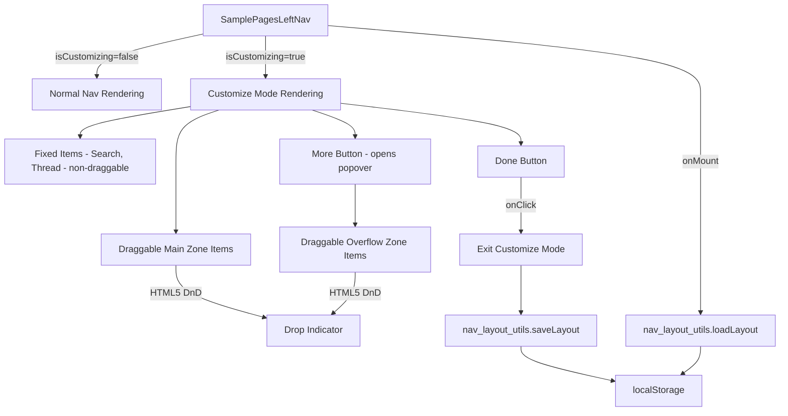
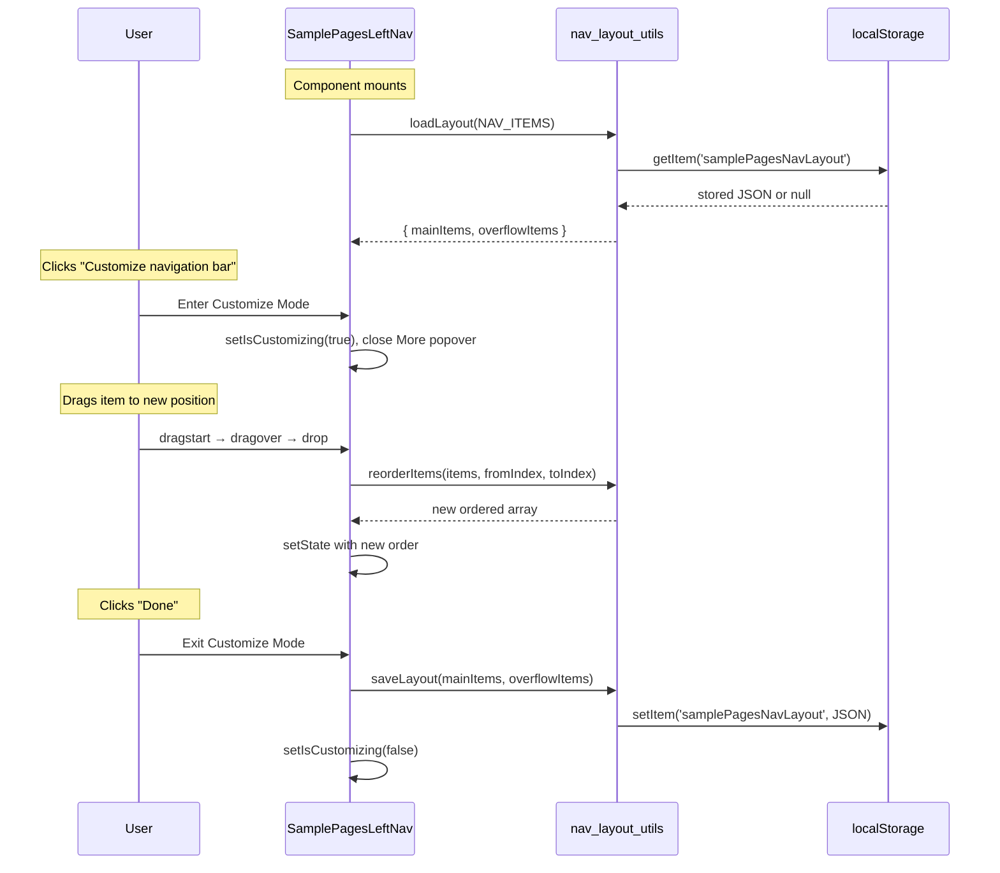

# Design Document: Draggable Nav Customization

## Overview

This feature adds drag-and-drop customization to the existing `SamplePagesLeftNav` component. Users enter a "Customize Mode" via a button in the More popover, which enables reordering of non-fixed nav items using the HTML5 Drag and Drop API. Items can be reordered within the main nav zone, within the More popover overflow zone, or moved between the two zones. The arrangement persists to `localStorage`.

### Key Design Decisions

1. **HTML5 Drag and Drop API (no external libraries)**: The native API is sufficient for this vertical list reordering use case. It avoids adding a dependency like `react-beautiful-dnd` and keeps the bundle small. Keyboard-based reordering is implemented as a parallel code path using Arrow keys + Enter/Space.

2. **State lifted into SamplePagesLeftNav**: All customize-mode state (`isCustomizing`, `mainItems`, `overflowItems`, `dragState`) lives in the existing `SamplePagesLeftNav` component. No new components are created for the nav itself — the existing render logic branches on `isCustomizing`.

3. **Separate layout utility module**: A pure-function utility module (`nav_layout_utils.js`) handles layout persistence (read/write/validate localStorage), item reordering logic, and cross-zone moves. This keeps the component lean and makes the logic independently testable.

4. **Existing OUI icon `grab` for drag handles**: The `grab` icon already exists in `src/components/icon/assets/grab.svg`. No custom SVGs needed.

5. **OUI design tokens only**: All customize-mode styling uses existing SCSS variables (`$ouiBorderColor`, `$ouiColorPrimary`, `$ouiColorLightestShade`, `$ouiColorEmptyShade`, `$ouiColorDarkestShade`, `$ouiFocusRingColor`). No invented tokens.

## Architecture



### Data Flow



## Components and Interfaces

### Modified Files

| File | Change |
|------|--------|
| `src-docs/src/views/sample_pages/sample_pages_left_nav.js` | Add customize mode state, drag-and-drop handlers, conditional rendering for customize mode UI |
| `src-docs/src/views/sample_pages/_sample_pages_left_nav.scss` | Add styles for customize mode indicator, drag handles, drop indicators, Done button |

### New Files

| File | Purpose |
|------|---------|
| `src-docs/src/views/sample_pages/nav_layout_utils.js` | Pure utility functions for layout persistence, reordering, and validation |

### nav_layout_utils.js Interface

```js
const STORAGE_KEY = 'samplePagesNavLayout';
const FIXED_KEYS = ['search', 'thread'];

/**
 * Load layout from localStorage. Returns { mainKeys, overflowKeys }.
 * Falls back to default order if missing/corrupted/stale.
 * @param {Array} allItems - The full NAV_ITEMS + overflow items array
 * @returns {{ mainKeys: string[], overflowKeys: string[] }}
 */
export function loadLayout(allItems) { ... }

/**
 * Save layout to localStorage.
 * @param {string[]} mainKeys - keys of items in main zone (excluding fixed)
 * @param {string[]} overflowKeys - keys of items in overflow zone
 */
export function saveLayout(mainKeys, overflowKeys) { ... }

/**
 * Reorder an array by moving element at fromIndex to toIndex.
 * Returns a new array.
 * @param {Array} items
 * @param {number} fromIndex
 * @param {number} toIndex
 * @returns {Array}
 */
export function reorderItems(items, fromIndex, toIndex) { ... }

/**
 * Move an item from one zone array to another.
 * Returns { source: [...], target: [...] }.
 * @param {Array} sourceItems
 * @param {number} sourceIndex
 * @param {Array} targetItems
 * @param {number} targetIndex
 * @returns {{ source: Array, target: Array }}
 */
export function moveItemBetweenZones(sourceItems, sourceIndex, targetItems, targetIndex) { ... }

/**
 * Validate a persisted layout against current NAV_ITEMS.
 * Discards unknown keys, appends new keys to overflow.
 * @param {{ mainKeys: string[], overflowKeys: string[] }} stored
 * @param {Array} allItems
 * @returns {{ mainKeys: string[], overflowKeys: string[] }}
 */
export function validateLayout(stored, allItems) { ... }
```

### SamplePagesLeftNav State Additions

```js
// New state
const [isCustomizing, setIsCustomizing] = useState(false);
const [mainItems, setMainItems] = useState([]);      // draggable items in main zone
const [overflowItems, setOverflowItems] = useState([]); // items in More popover
const [dragState, setDragState] = useState({
  draggedKey: null,       // key of item being dragged
  sourceZone: null,       // 'main' | 'overflow'
  dropTargetIndex: null,  // index where drop indicator shows
  dropTargetZone: null,   // 'main' | 'overflow'
});

// ARIA live region for screen reader announcements
const [liveAnnouncement, setLiveAnnouncement] = useState('');
```

### Drag and Drop Handlers (on SamplePagesLeftNav)

```js
// HTML5 DnD handlers attached to each draggable item
const handleDragStart = (e, key, zone) => { ... };
const handleDragOver = (e, index, zone) => { ... };  // preventDefault + update dropTargetIndex
const handleDrop = (e, index, zone) => { ... };       // reorder or cross-zone move
const handleDragEnd = (e) => { ... };                  // reset dragState

// Keyboard handlers for accessible reordering
const handleKeyDown = (e, key, index, zone) => { ... }; // Enter/Space to pick up, Arrows to move, Enter/Space to drop
```

### Customize Mode UI Changes

When `isCustomizing === true`:
- The nav wrapper gets a `samplePagesLeftNav--customizing` class (adds a subtle border/background)
- Fixed items (Search, Thread) render without drag handles and with a `samplePagesLeftNav__navItem--fixed` class
- Draggable items render with a `grab` icon overlay and `draggable="true"` attribute
- A "Done" button appears below the nav items
- The More popover stays accessible and its items are also draggable
- An ARIA live region (`role="status"`, `aria-live="polite"`) announces drag state changes


## Data Models

### Nav_Layout (localStorage)

```json
{
  "mainKeys": ["discover", "service"],
  "overflowKeys": ["alerts", "dashboards", "skills", "manage-workspace"]
}
```

| Field | Type | Description |
|-------|------|-------------|
| `mainKeys` | `string[]` | Ordered keys of draggable items in the Main Zone (excludes fixed items and "more") |
| `overflowKeys` | `string[]` | Ordered keys of items in the Overflow Zone |

Storage key: `samplePagesNavLayout`

### Default Layout (when no persisted data)

Derived from the existing `NAV_ITEMS` array and the hardcoded overflow items in `MorePanelContent`:

- **mainKeys**: `['discover', 'service']`
- **overflowKeys**: `['alerts', 'dashboards', 'skills', 'manage-workspace']`

### ALL_NAV_ITEMS Registry

A new constant that merges the current `NAV_ITEMS` draggable entries with the overflow items, giving each a consistent shape:

```js
const ALL_DRAGGABLE_ITEMS = [
  { key: 'discover', label: 'Discover', icon: 'navDiscover' },
  { key: 'service', label: 'APM', icon: 'navAnomalyDetection' },
  { key: 'alerts', label: 'Alerts', icon: 'navAlerting' },
  { key: 'dashboards', label: 'Dashboards', icon: 'navDashboards' },
  { key: 'skills', label: 'Skills', icon: 'navReports' },
  { key: 'manage-workspace', label: 'Manage workspace', icon: 'wsSelector' },
];
```

### Drag State

```js
{
  draggedKey: string | null,     // key of item currently being dragged
  sourceZone: 'main' | 'overflow' | null,
  dropTargetIndex: number | null, // position of the drop indicator
  dropTargetZone: 'main' | 'overflow' | null,
}
```

### Keyboard Reorder State

```js
{
  pickedUpKey: string | null,    // key of item picked up via keyboard
  pickedUpZone: 'main' | 'overflow' | null,
  currentIndex: number | null,   // current position during keyboard move
}
```


## Correctness Properties

*A property is a characteristic or behavior that should hold true across all valid executions of a system — essentially, a formal statement about what the system should do. Properties serve as the bridge between human-readable specifications and machine-verifiable correctness guarantees.*

### Property 1: Fixed items invariant

*For any* sequence of reorder and cross-zone move operations applied to the nav layout, the fixed items (Search and Thread) shall always remain at positions 0 and 1 in the main zone in their original order, and shall never appear in the overflow zone.

**Validates: Requirements 2.1, 2.2**

### Property 2: Reorder preserves elements

*For any* array of items and any valid pair of indices (fromIndex, toIndex), calling `reorderItems(items, fromIndex, toIndex)` shall produce a new array that contains exactly the same elements as the original, with the element originally at `fromIndex` now at `toIndex` and all other elements shifted accordingly.

**Validates: Requirements 3.1, 3.3, 4.1, 4.3**

### Property 3: Cross-zone move correctness

*For any* source array, target array, valid source index, and valid target index, calling `moveItemBetweenZones(source, sourceIndex, target, targetIndex)` shall produce a new source array with the item removed and a new target array with the item inserted at `targetIndex`, and the combined set of elements across both arrays shall be unchanged.

**Validates: Requirements 5.1, 5.2**

### Property 4: Layout persistence round-trip

*For any* valid nav layout (mainKeys and overflowKeys arrays containing a partition of all draggable item keys), saving the layout via `saveLayout` and then loading it via `loadLayout` shall produce an equivalent layout.

**Validates: Requirements 6.2, 7.1, 7.2**

### Property 5: Layout validation handles stale data

*For any* persisted layout containing unknown keys (not in current NAV_ITEMS) and missing new keys (in current NAV_ITEMS but not in persisted layout), `validateLayout` shall discard all unknown keys and append all new keys to the overflow zone, producing a layout that contains exactly the current set of draggable item keys.

**Validates: Requirements 7.4**

### Property 6: Cancelled drag is a no-op

*For any* nav layout state, if a drag operation begins but ends without a valid drop (dragEnd fires without a preceding drop), the layout shall be identical to the layout before the drag started.

**Validates: Requirements 8.3**

### Property 7: Keyboard reorder equivalence

*For any* draggable item at position `i` in a zone, picking it up via keyboard (Enter/Space) and pressing the down arrow `n` times then dropping (Enter/Space) shall produce the same result as calling `reorderItems(items, i, i + n)`.

**Validates: Requirements 10.2**

## Error Handling

| Scenario | Handling |
|----------|----------|
| localStorage is unavailable (private browsing, quota exceeded) | `saveLayout` wraps `setItem` in try/catch and silently fails. `loadLayout` returns default layout. |
| Persisted JSON is malformed | `loadLayout` catches JSON.parse errors and returns default layout. (Req 7.3) |
| Persisted layout references removed nav items | `validateLayout` filters out unknown keys. (Req 7.4) |
| New nav items added to code but not in persisted layout | `validateLayout` appends new keys to overflowKeys. (Req 7.4) |
| Drag operation cancelled (drop outside valid target) | `handleDragEnd` resets `dragState` to null values; no layout change. (Req 8.3) |
| User drags a fixed item (Search/Thread) | Fixed items do not have `draggable="true"` attribute; drag cannot initiate. |
| Keyboard reorder at boundary (arrow up at index 0, arrow down at last index) | Handler clamps index to valid range; no-op at boundaries. |

## Testing Strategy

### Unit Tests

1. **Enter customize mode**: Click "Customize navigation bar" → verify `isCustomizing` becomes true and More popover closes.
2. **Exit customize mode**: Click "Done" → verify `isCustomizing` becomes false and customize UI elements are removed.
3. **Fixed items non-draggable**: In customize mode, verify Search and Thread items do not have `draggable` attribute.
4. **Drag handle presence**: In customize mode, verify each draggable item renders a `grab` icon.
5. **Default layout on first load**: With empty localStorage, verify items render in default order.
6. **Corrupted localStorage fallback**: Set malformed JSON in localStorage, mount component, verify default layout renders.
7. **ARIA live announcements**: Pick up an item via keyboard, verify the live region text updates.
8. **Tab focus in customize mode**: Verify draggable items are focusable via Tab key.

### Property-Based Tests

Property-based tests use `fast-check` with a minimum of 100 iterations per property.

**Test 1: Fixed items invariant**
- Generator: random sequence of `reorderItems` and `moveItemBetweenZones` calls with random valid indices
- Assert: after all operations, fixed items are at positions 0 and 1 in main zone, never in overflow
- Tag: `Feature: draggable-nav-customization, Property 1: Fixed items invariant`

**Test 2: Reorder preserves elements**
- Generator: random array of unique strings (length 2–10), random fromIndex and toIndex within bounds
- Assert: result contains same elements, element at fromIndex moved to toIndex
- Tag: `Feature: draggable-nav-customization, Property 2: Reorder preserves elements`

**Test 3: Cross-zone move correctness**
- Generator: two random arrays of unique strings, random valid source and target indices
- Assert: moved item removed from source, inserted at targetIndex in target, combined elements unchanged
- Tag: `Feature: draggable-nav-customization, Property 3: Cross-zone move correctness`

**Test 4: Layout persistence round-trip**
- Generator: random partition of ALL_DRAGGABLE_ITEMS keys into mainKeys and overflowKeys
- Assert: `loadLayout` after `saveLayout` returns equivalent layout
- Tag: `Feature: draggable-nav-customization, Property 4: Layout persistence round-trip`

**Test 5: Layout validation handles stale data**
- Generator: random stored layout with some unknown keys added and some current keys removed
- Assert: `validateLayout` output contains exactly the current draggable keys, unknown keys discarded, new keys in overflow
- Tag: `Feature: draggable-nav-customization, Property 5: Layout validation handles stale data`

**Test 6: Cancelled drag is a no-op**
- Generator: random layout state, random dragStart event (random item and zone)
- Assert: calling handleDragEnd without handleDrop leaves layout unchanged
- Tag: `Feature: draggable-nav-customization, Property 6: Cancelled drag is a no-op`

**Test 7: Keyboard reorder equivalence**
- Generator: random array of items, random start index, random number of arrow presses (0–length)
- Assert: keyboard reorder result equals `reorderItems(items, startIndex, startIndex + n)` (clamped)
- Tag: `Feature: draggable-nav-customization, Property 7: Keyboard reorder equivalence`
