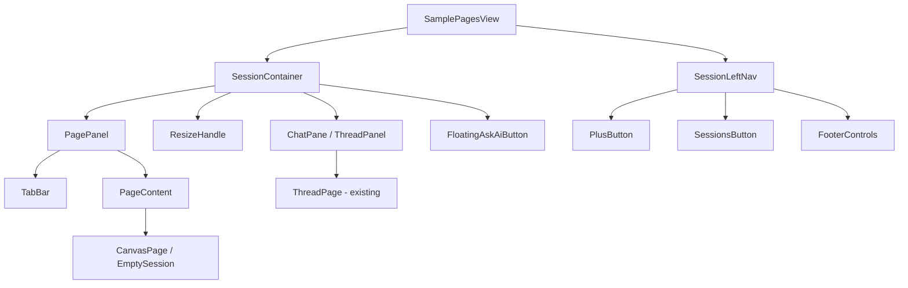
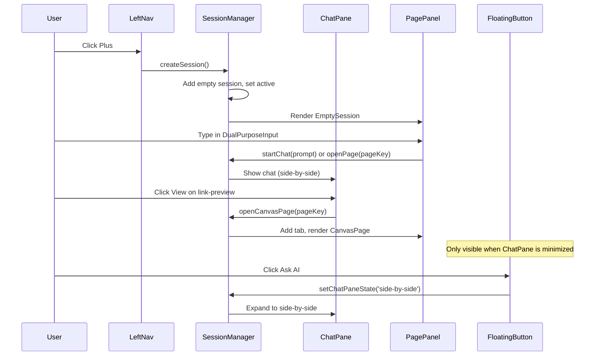

# Design Document: Session-Based Navigation

## Overview

This design replaces the current icon-based left navigation in the OUI sample pages with a session-based model. Each session is an independent workspace (analogous to a conversation) containing a chat/conversation pane (left) and a pages pane (right) with browser-like tabs. The left navigation is reduced to two primary actions (create session, browse sessions) plus a footer with workspace controls.

The redesign transforms the information architecture from a flat page-list model to a contextual workspace model where users operate within focused sessions, each maintaining its own conversation and set of open pages.

### Key Design Decisions

1. **Session = Conversation context**: Sessions replace top-level nav items. Each session encapsulates a conversation + pages. A session IS the thread — there is no separate "thread" concept within a session.
2. **Two-panel layout**: Left panel is the conversation/chat pane (the existing ThreadPage). Right panel displays pages with browser-like tabs. There is no popover or intermediate AI panel — the chat pane IS the AI interaction surface.
3. **Floating Ask AI button**: Only visible when the chat pane is minimized. Clicking it expands the chat pane to side-by-side mode. It does NOT open a popover.
4. **Reuse existing components**: ThreadPage and mock canvas pages are reused with minimal modification. The session layer wraps them.
5. **State lifted to session manager**: A new session state manager replaces the current `activePage`/`selectedItem` pattern in SamplePagesView with a session-aware model.
6. **localStorage persistence**: Continues the existing pattern (see `nav_layout_utils.js`) for persisting session state across reloads.

## Architecture



### Component Hierarchy

```
SamplePagesView (root)
├── SessionLeftNav (simplified nav)
│   ├── Logo
│   ├── PlusButton (create session)
│   ├── SessionsButton (browse sessions, badge)
│   └── Footer (workspace, devtools, settings, avatar)
└── SessionContainer (active session)
    ├── ChatPane (left, 3 size states — wraps existing ThreadPage)
    │   ├── ThreadPage (existing component, reused as-is)
    │   └── InputArea (part of ThreadPage)
    ├── ResizeHandle (drag divider, only in side-by-side)
    ├── PagePanel (right, browser tabs)
    │   ├── TabBar
    │   │   ├── PageTab[] (open tabs)
    │   │   └── AddTabButton
    │   └── TabContent
    │       ├── CanvasPage (AlertPageMock, LogsPageMock, etc.)
    │       ├── EmptySession (welcome experience)
    │       └── NewTabPage (page picker)
    └── FloatingAskAiButton (only visible when ChatPane is minimized)
```

### Data Flow



## Components and Interfaces

### SessionLeftNav

Replaces `SamplePagesLeftNav`. A narrow, collapsed sidebar with minimal controls.

```typescript
interface SessionLeftNavProps {
  sessionCount: number;        // Badge count for sessions button
  onCreateSession: () => void; // Plus button handler
  onBrowseSessions: () => void; // Sessions button handler
  activeView: 'session' | 'session-list'; // Current view context
}
```

Renders:
- OpenSearch logo at top
- `plusInCircle` icon button — creates new session
- `apps` icon button with badge — opens session list
- Footer: workspace selector, `wrench` (devtools), `gear` (settings), `OuiAvatar`

### SessionContainer

Manages the split layout for the active session.

```typescript
interface SessionContainerProps {
  session: Session;
  onUpdateSession: (updates: Partial<Session>) => void;
  onOpenCanvasPage: (pageKey: string, title: string) => void;
}
```

### ChatPane (ThreadPanel)

Wraps the existing `ThreadPage` component with size-state controls. This IS the conversation — there is no separate AI popover.

```typescript
interface ChatPaneProps {
  sizeState: 'minimized' | 'side-by-side' | 'full-screen';
  onSizeChange: (state: 'minimized' | 'side-by-side' | 'full-screen') => void;
  threadKey: string | null;
  pendingThread: PendingThread | null;
  onViewAction: (pageKey: string, title: string) => void;
  width: number; // percentage, controlled by resize
}
```

### PagePanel

Manages browser-like tabs and renders page content. Does NOT contain any AI interaction UI — that lives in the ChatPane.

```typescript
interface PagePanelProps {
  tabs: PageTab[];
  activeTabId: string;
  onTabSelect: (tabId: string) => void;
  onTabClose: (tabId: string) => void;
  onAddTab: () => void;
}
```

### FloatingAskAiButton

A floating button that appears ONLY when the ChatPane is minimized. Clicking it expands the ChatPane to side-by-side mode. It does NOT open a popover or inline panel.

```typescript
interface FloatingAskAiButtonProps {
  visible: boolean; // true only when chatPaneState === 'minimized'
  onClick: () => void; // expands chat pane to side-by-side
}
```

### ResizeHandle

A draggable divider between ChatPane and PagePanel.

```typescript
interface ResizeHandleProps {
  onResize: (leftWidthPercent: number) => void;
  isActive: boolean; // only visible in side-by-side
}
```

### EmptySessionPage

The welcome experience shown when a session has no conversation started and no pages open.

```typescript
interface EmptySessionPageProps {
  onStartChat: (prompt: string) => void;
  onOpenPage: (pageKey: string) => void;
  recentItems: RecentItem[];
  favoriteItems: FavoriteItem[];
  systemAlert: SystemAlert | null;
}
```

### SessionList

Displayed when user clicks the Sessions button.

```typescript
interface SessionListProps {
  sessions: Session[];
  activeSessionId: string;
  onSelectSession: (sessionId: string) => void;
  onCreateSession: () => void;
}
```

## Data Models

### Session

```typescript
interface Session {
  id: string;                          // Unique session identifier
  threadKey: string | null;            // Active conversation key (null = no conversation started)
  pendingThread: PendingThread | null; // Conversation being created
  tabs: PageTab[];                     // Open page tabs
  activeTabId: string | null;          // Currently active tab
  chatPaneState: 'minimized' | 'side-by-side' | 'full-screen';
  chatPaneWidth: number;               // Width percentage in side-by-side (20-80)
  createdAt: number;                   // Timestamp
  title: string;                       // Display title (derived from conversation or "New Session")
}
```

### PageTab

```typescript
interface PageTab {
  id: string;           // Unique tab identifier
  pageKey: string;      // Key mapping to a canvas page component (e.g., 'logs', 'alerts')
  title: string;        // Display title in tab bar
}
```

### PendingThread

```typescript
interface PendingThread {
  key: string;
  messages: ThreadMessage[];
}
```

### SystemAlert

```typescript
interface SystemAlert {
  id: string;
  message: string;
  actionLabel: string;
  actionTarget: string; // pageKey or URL
  severity: 'critical' | 'warning';
}
```

### RecentItem / FavoriteItem

```typescript
interface RecentItem {
  id: string;
  title: string;
  type: 'page' | 'session';
  pageKey?: string;
  sessionId?: string;
  visitedAt: number;
}

interface FavoriteItem {
  id: string;
  title: string;
  type: 'page' | 'session';
  pageKey?: string;
  sessionId?: string;
}
```

### SessionState (localStorage schema)

```typescript
interface PersistedSessionState {
  sessions: Session[];
  activeSessionId: string;
  version: number; // Schema version for migration
}
```

The `version` field enables forward-compatible migrations if the schema changes. On load, if `version` is missing or outdated, the system falls back to a default empty session.

### SOURCE_PAGE_MOCK Mapping (existing, reused)

```typescript
const SOURCE_PAGE_MOCK: Record<string, { component: React.ComponentType; title: string }> = {
  logs: { component: LogsPageMock, title: 'Logs' },
  alerts: { component: AlertPageMock, title: 'Alerts' },
  'alerts-detail': { component: AlertPageMock, title: 'Alerts Detail' },
  dashboards: { component: DashboardPageMock, title: 'Dashboards' },
  notebooks: { component: InventoryAnalysisPageMock, title: 'Notebooks' },
  metrics: { component: ConnectionPoolPageMock, title: 'Metrics' },
  discover: { component: LogsPageMock, title: 'Discover' },
  traces: { component: TraceAnalysisPageMock, title: 'Trace Analysis' },
};
```

